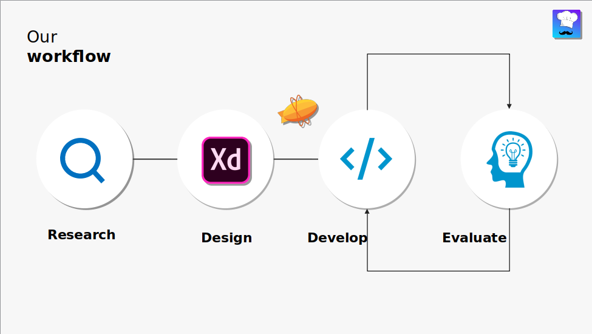

# Foodes 

Foodes is a Android application for recipes designed for people who are looking for simple and tasty recipes every day 

## Features
 - Create account / Login
 - Forgot password
 - View user profile
 - Search recipes 
 - Like a recipe
- Add recipes to favorites
& see someone else’s favorites
- Reorder user favorites
- Share a recipe

### Workflow

### Libraries Used
- [Glide](https://bumptech.github.io/glide/) for image loading 
- [Volley](https://developer.android.com/training/volley/index.html) for networking Android apps easier and faster
- [Material Design](https://material.io/design/) to create intuitive and beautiful products

